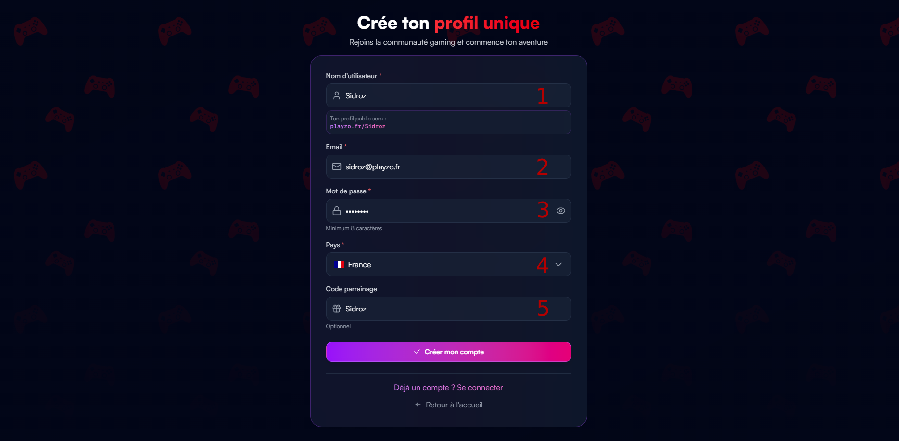
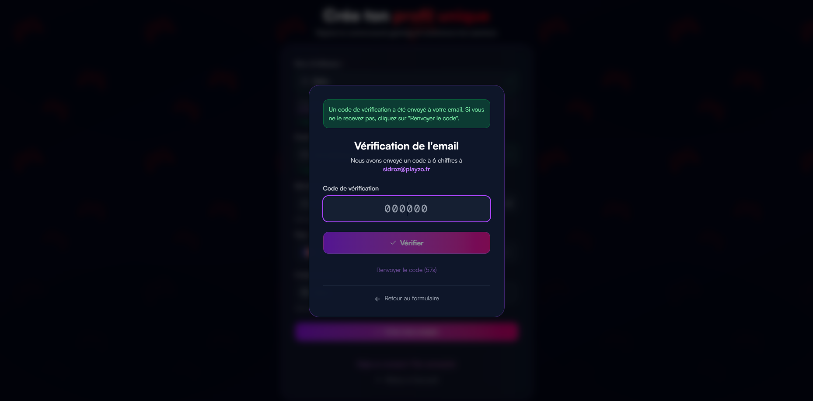

<Tabs>
  <Tab title="Sign up">
    <Info>
      To create an account on playzo.fr, open the [registration page](https://playzo.fr/register)
    </Info>

    <Frame>
      
    </Frame>

    <Icon icon="square-1" size="1.5em" /> Enter the username you want  
    <Icon icon="square-2" size="1.5em" /> Enter your email address  
    <Icon icon="square-3" size="1.5em" /> Create a password for your account  
    <Icon icon="square-4" size="1.5em" /> Choose your country  
    <Icon icon="square-5" size="1.5em" /> If you were referred by a user with an affiliate code, enter it here. Otherwise, leave this field empty.

    ---

    ## Email Verification

    <Frame>
      
    </Frame>

    A verification code will be sent to you by email. Enter the 6-digit code in the dedicated field and click **“Verify”**.

    <Card title="Welcome" icon="arrow-right" href="/en/playzo/register#welcome">
      ‎
    </Card>
  </Tab>

  <Tab title="Welcome">
    Once your registration is complete, you will be redirected to the welcome page.

    <Frame>
      
    </Frame>

    <Card title="Continue (Onboarding)" icon="arrow-right" href="/en/overview/register#onboarding">
      ‎
    </Card>
  </Tab>
</Tabs>
